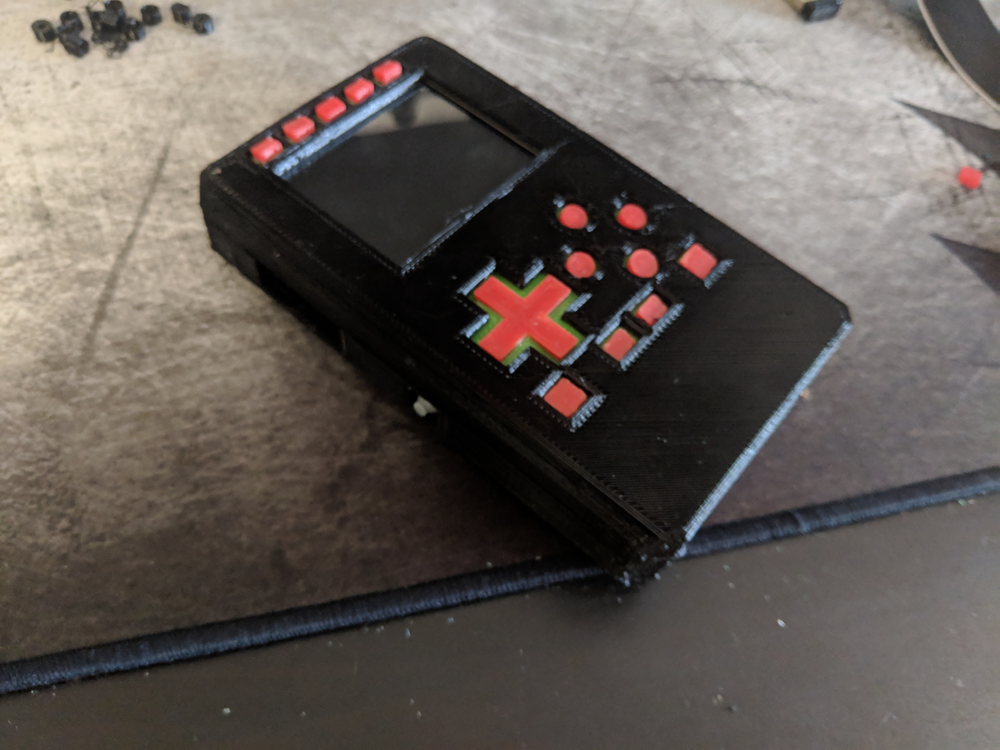

# 🎮 Portable Handheld

Portable retropie system inspired by the pocket pigrrl

## 🎯 Design Goals
- ✅ must fit in pocket
- ✅ must be sturdy  
- ✅ expose audio and hdmi on side of case
- ✅ must be modular and easy to replace parts

## 🖨️ Printing Instructions
- 🚀 prototype STLs are available in the v0.9 folder (v1 is pending some improvements listed in `main.scad`)
- 📦 needs to be printed in 2 halves, a front half and back half.
  - 🚫 **no supports needed!**

- 🔧 print 12 `washer_4mm.stl` (color does not matter, these are internal) if using `4-40 x 3/8"` screws (these were the screws I had on hand, and were recommended for the pigrrl 2)

### 📋 Detailed Printing Instructions

⚠️ **Make sure your printer is calibrated well!** 
🔗 https://www.thingiverse.com/thing:533472/files I recommend the negative space tolerance test.

#### 🧱 **PETG/PLA preferable:**
  - `front_case.stl`
    - ⚠️ **flip upside down!**
  - `back_case.stl`

#### 🌊 **Flexible plastic:**
  - front buttons: **print both together!**
    - `front_buttons.stl`
    - `front_flex.stl`

## 🛒 Parts List

💰 Parts list comes to about **$120** of hardware from Adafruit, including the battery, sd card and pi.

### 🔧 Core Components
- 🥧 [Raspberry pi 3 A+](https://www.adafruit.com/product/4027)
- 📱 [Adafruit PITFT 2.4" touchscreen](https://www.adafruit.com/product/2455)
- 🔌 [26-pin cable](https://www.adafruit.com/product/862)
- 🔋 [powerboost 1000c](https://www.adafruit.com/product/2465)
  - 🚨 **no substitutes!**
  - 🔌 [decent power supply](https://www.adafruit.com/product/1995)

### 🔩 Hardware & Electronics
- 🔧 perfboard
- 🔩 [#4-40 3/8 screws](https://www.amazon.com/Machine-Screws-Phillips-Stainless-Quantity/dp/B01LY5VW6Q)
  - 🔄 possibly substitute with `M3` and modify screws in `main.scad`
  - ⚖️ depending on length, printed washer_4mm may not be needed
- 🔘 [slim tactile buttons](https://www.adafruit.com/product/1489) for PITFT
- 🎮 [soft tactile buttons](https://www.adafruit.com/product/3101)
  - 🔄 can substitute with [clicky switches](https://www.adafruit.com/product/367)
- 🔌 wires
- 💾 sd card, one big enough for all your games!
- 🔀 [slide switch](https://www.adafruit.com/product/805)
- 🔋 [3.7v 200mAh battery](https://www.adafruit.com/product/2011)